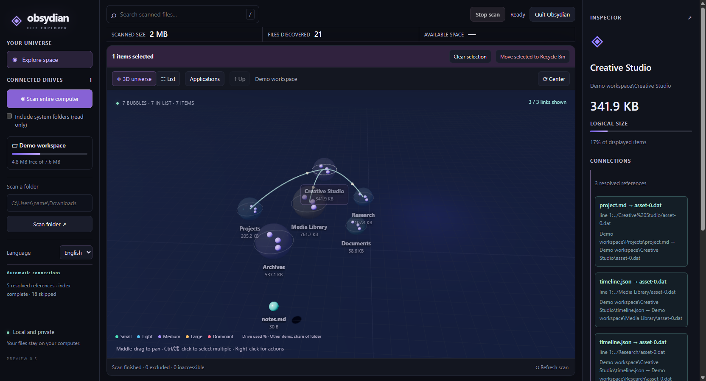

# Obsydian Finder

Explore disk space in a native desktop window. A real 3D scene shows files, folders, installed applications and the connections the scanner can verify. Scans and reference indexing appear progressively. English is the default; Italian is available.

The screenshot uses demonstration files. Everything runs locally.

## Download and open

Get the free app from [Releases](https://github.com/jaydemks/ObsydianFinder/releases/latest). Extract the entire archive before opening it. Python and a browser are not required.

| System | Open |
| --- | --- |
| Windows 10/11, x64 | `Obsydian Finder.exe` inside the extracted folder |
| macOS, Apple silicon | `Obsydian Finder.app` |
| Linux, x64, Ubuntu 24.04 or compatible | `Obsydian Finder` inside the extracted folder |

Close the window to keep the app in the tray. Use **Quit Obsydian** in the window or tray menu to stop everything. On desktops without tray support, closing the window quits. Builds are unsigned; macOS may require approval in Privacy & Security. Windows is tested locally; macOS and Linux are built and unit tested in GitHub Actions.

## Use

Choose a drive, a folder or **Scan entire computer**. **Stop scan** preserves the results already found. Drag with the middle mouse button to pan, drag the background with the left button to orbit, and scroll to zoom. Double-click a folder to enter; **Up** returns to its parent.

Right-click a bubble for actions. Ctrl/Command-click selects multiple items. Deletion moves files to the operating system trash after confirmation. Bubble size represents logical file size. Colors show drive usage or an item's share of its folder.

Select an item to see reference arrows and their evidence. **Applications** shows discovered installations and declared components. Windows and supported Linux installations open their official removal tool; macOS reveals the application in Finder. Removal is never inferred from file connections.

Connections are static file references and installation metadata, not a complete map of runtime dependencies. Some applications, protected files and references cannot be discovered. Removing an application does not guarantee removal of all settings or shared data. See [details and source setup](docs/USAGE.md).

## Source and license

Free and open source under the [MIT license](LICENSE). Bundled libraries retain their [own licenses](THIRD_PARTY_NOTICES.md). GitHub Actions produces standalone archives for all three systems.
